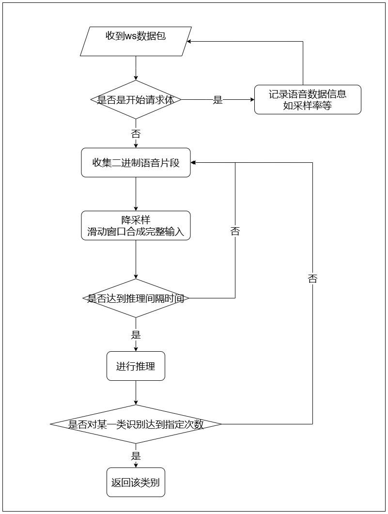

# 语音唤醒模块（KWS）

## 目录

以下是按照您要求的格式导出的标题结构：

- [KWS](#kws)
  - [目录](#目录)
  - [1. 简介](#1-简介)
  - [2. 目录结构说明](#2-目录结构说明)
  - [3. 算法层说明](#3-算法层说明)
    - [3.1 kws接口定义](#31-kws接口定义)
    - [3.2 模型训练](#32-模型训练)
    - [3.3 模型编译](#33-模型编译)
  - [4. 服务层说明](#4-服务层说明)
    - [4.1 服务层流程图](#41-服务层流程图)
    - [4.2 服务层接口说明](#42-服务层接口说明)
  - [5. 例程测试](#5-例程测试)
    - [5.1 参数说明](#51-参数说明)
    - [5.2 编译cpp算法层](#52-编译cpp算法层)
    - [5.3 安装服务层依赖](#53-安装服务层依赖)
    - [5.4 运行服务](#54-运行服务)
  - [6. 容器中启动服务](#6-容器中启动服务)
    - [6.1 环境准备](#61-环境准备)
    - [6.2 构建docker镜像](#62-构建docker镜像)
    - [6.3 启动容器与服务](#63-启动容器与服务)

  
## 1. 简介
当前语音唤醒模块基于[PANNs](https://github.com/qiuqiangkong/audioset_tagging_cnn?tab=readme-ov-file)实现，目前该例程支持的唤醒词包括：你好算能、清除缓存、清空缓存。

## 2 目录结构说明

```bash
.
├── 3rdparty            # cpp例程依赖的第三方库
├── config.yaml         # server配置文件
├── cpp                 # cpp例程源码
├── docs                # 服务层接口文档
├── pics                
├── readme.md       
├── requirements.txt    # server的库依赖
├── scripts             # 转模型脚本
└── server.py           # server服务

```

## 3 算法层说明
注：算法层的实现不唯一，本例程的算法层是c++实现的，对原模型和预处理有一些修改，最终由pybind将c++类接口绑定成python类接口供服务层调用。**如果您有其他需求，您可以自行训练模型和编写算法层的程序。**

### 3.1 kws接口定义
底层c++类接口通过pybind绑定后得到python类接口，可以直接参考[cpp/sound_classification.pyi](cpp/sound_classification.pyi)。您也可以按照这些接口定义自行实现这些接口的细节，达到平替的效果。

### 3.2 模型训练
**如果您有自己的训练方式、模型选择、例程实现，您可以跳过此步骤。**

模型训练参考[PANNs](https://github.com/qiuqiangkong/audioset_tagging_cnn?tab=readme-ov-file)中提供的训练方法。您可以按照您的需求修改模型结构和参数量，并自行准备与您唤醒词有关的数据集。

**本例程中使用的模型为原仓库中的CNN10，对原模型的参数有一些修改，并将原仓库中提取特征的部分单独抽出来作为单独的类，因为后续使用tpu运行的是这个CNN部分。原始音频数据先经过以下类抽取特征后，将特征输入CNN模型获取分类结果。** 以下是一个示例，参数可以自行指定：
```c++
class ExtractFeature(nn.Module):
    def __init__(self, sample_rate, num_mel=40, window='hann', center=True, pad_mode='reflect',
                ref= 1.0, n_fft=1024, amin=1e-6, top_db = None, hop_length=256, fmin=0):
        super(ExtractFeature, self).__init__()
        n_mels = num_mel
        win_length = n_fft
        fmax = sample_rate // 2
        self.spectrogram_extractor = Spectrogram(n_fft=n_fft, hop_length=hop_length,
            win_length=win_length, window=window, center=center, pad_mode=pad_mode,
            freeze_parameters=True)
 
        self.logmel_extractor = LogmelFilterBank(sr=sample_rate, n_fft=n_fft,
            n_mels=n_mels, fmin=fmin, fmax=fmax, ref=ref, amin=amin, top_db=top_db,
            freeze_parameters=True,is_log=True)
 
    def forward(self, inputs):
        x = self.spectrogram_extractor(inputs)
        logmel_spec = self.logmel_extractor(x)
        return logmel_spec
```

本例程中提供的训练模型，接受输入语音的长度为2s，采样率是8000。如果您使用了其他语音长度或采样率，或不同于上述特征提取的参数，您后续需要修改相关的推理代码（main.cpp中的sample_rate和time_len、SoundClassificationV2类中的audio_param_成员变量）以适配您自定义的训练参数。


### 3.3 模型编译

原模型需要编译成BModel才能在SOPHON TPU上运行，在编译前要导出成onnx模型，如果您使用的TPU-MLIR版本>=v1.3.0（即官网v23.07.01），也可以直接使用torchscript模型。

建议使用TPU-MLIR编译BModel，模型编译前需要安装TPU-MLIR，具体可参考[TPU-MLIR环境搭建](../../docs/Environment_Install_Guide.md#1-tpu-mlir环境搭建)。安装好后需在TPU-MLIR环境中进入例程目录，并使用本例程提供的脚本将onnx模型编译为BModel。脚本中命令的详细说明可参考《TPU-MLIR开发手册》(请从[算能官网](https://developer.sophgo.com/site/index.html?categoryActive=material)相应版本的SDK中获取)。

**如果您有自己的训练方式、模型选择、例程实现，请您参考上述MLIR的介绍自行转出bmodel，并跳过本小节后续内容。**

**关于本例程：按照上一训练章节中的说明，您需要将已经把特征提取部分分离出来的CNN模型导出onnx，后续将该onnx导出bmodel。**

- 数据模型准备

执行以下命令可提前下好本例程使用的onnx和bmodel
```bash
./scripts/download.sh
```

- 生成fp16 BModel

​本例程在`scripts`目录下提供了生成fp16 BModel的脚本，请注意修改`gen_fp16bmodel_mlir.sh`中的onnx模型路径、生成模型目录和输入大小shapes等参数：

```shell
./scripts/gen_fp16bmodel_mlir.sh 
```

​上述脚本会在`models/BM1688`文件夹下生成`suan_neng_v3_fp16.bmodel`，即转换好的fp16 BModel。


## 4. 服务层说明

### 4.1 服务层流程图

服务层流程图如下：



### 4.2 服务层接口说明

请参考[docs/interface.md](./docs/interface.md)


## 5. 例程测试
### 5.1 参数说明
算法配置参数在config.yaml中，参数说明如下：
```yaml
models:
  - name: nihaosuanneng                 # 算法名称
    bmodel_path: ./models/BM1688/suan_neng_v3_fp16.bmodel      # bmodel路径
    dev_id: 0                           # 使用的设备id
    threshold: 0.5                      # 算法阈值，分类的最大类别概率小于这个数会被认为是背景

```

### 5.2 编译cpp算法层
cpp算法层依赖eigen和pybind，您可以通过以下方式安装：
```bash
sudo apt update
sudo apt install libeigen3-dev
pip3 install pybind11
```
注：当前CMakeList.txt中的pybind路径为上述安装得到的默认路径，如果您pybind有自定义安装方式，您可以修改相应路径：
```cmake
set(CMAKE_PREFIX_PATH "/home/linaro/.local/lib/python3.8/site-packages/pybind11/")
```
通过pip安装的pybind路径可以通过以下命令查询（查询结果为pybind所在路径，上述路径还需加上pybind11目录）：
```
pip3 show pybind11
```

请在设备上按以下操作执行，以生成服务层所使用的算法层接口：
```bash
cd cpp
mkdir build 
cd build
cmake ..
make
```
上述操作会在cpp目录下生成sound_classification.so

### 5.3 安装服务层依赖
安装方式：
```bash
pip3 install dfss -i https://pypi.tuna.tsinghua.edu.cn/simple --upgrade
python3 -m dfss --url=open@sophgo.com:tools/silk2/silk2.tools.logger-1.0.2-py3-none-any.whl
pip3 install silk2.tools.logger-1.0.2-py3-none-any.whl
pip3 install -r requirements.txt
```

### 5.4 运行服务
在service_kws目录下运行下面命令即可启动服务：
```bash
python3 server.py [--config path/to/config] [--loglevel info] [--ip 127.0.0.1] [--port 18080]

可选参数：（非必须）
--config        config.yaml路径，默认是当前目录下的config.yaml
--loglevel      服务的log等级，默认info
--ip            服务启动的ip，默认127.0.0.1
--port          服务启动的port，默认18080

```

# 6. 容器中启动服务

## 6.1 环境准备
在service_kws目录下预先准备好silk2.tools.logger-1.0.2-py3-none-any.whl，如果没有的话可以通过以下命令下载：

```bash
pip3 install dfss -i https://pypi.tuna.tsinghua.edu.cn/simple --upgrade
python3 -m dfss --url=open@sophgo.com:tools/silk2/silk2.tools.logger-1.0.2-py3-none-any.whl
```
同时您需要参照[5.2节](#52-编译cpp算法层)完成cpp算法层的编译。

## 6.2 构建docker镜像

通过service_kws目录下的Dockerfile构建包含运行环境的镜像：

```bash
docker build -t service_kws:1.1.0 .
```
镜像名为service_kws:1.1.0，请根据需要自行修改镜像名和版本号。

## 6.3 启动容器与服务
dockerfile中默认将代码和模型拷贝到镜像中。以下命令可以映射服务的相关端口，在启动容器的同时执行服务启动命令，并挂载了容器外面的日志路径。
您可以按照您的具体情况修改以下命令，如映射的端口，服务程序所在路径，以及执行的具体命令：

```bash
sudo docker run \
-td \
--privileged=true \
-v /opt/sophon:/opt/sophon \
-v /dev:/dev \
-v /etc/profile.d:/etc/profile.d \
-v /etc/profile:/etc/profile \
-v /etc/ld.so.conf.d:/etc/ld.so.conf.d \
-v /data/kws_log:/data/kws_log \
-p 18080:18080 \
--name service_kws service_kws:1.1.0 /bin/bash -c "cd /workspace/service_kws && python3 server.py --ip 0.0.0.0 > /data/kws_log/kws_log_$(date +%Y-%m-%d).txt 2>&1"
```
