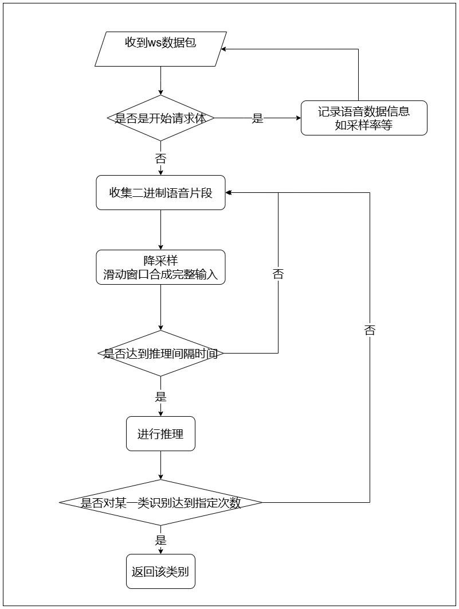

# 语音唤醒模块（KWS）

## 目录

以下是按照您要求的格式导出的标题结构：

- [KWS](#kws)
  - [目录](#目录)
  - [1. 简介](#1-简介)
  - [2. 目录结构说明](#2-目录结构说明)
  - [3. 算法层说明](#3-算法层说明)
    - [3.1 kws接口定义](#31-kws接口定义)
    - [3.2 模型训练](#32-模型训练)
    - [3.3 模型编译](#33-模型编译)
  - [4. 服务层说明](#4-服务层说明)
    - [4.1 服务层流程图](#41-服务层流程图)
    - [4.2 服务层接口说明](#42-服务层接口说明)
  - [5. 例程测试](#5-例程测试)
    - [5.1 参数说明](#51-参数说明)
    - [5.2 安装算法层依赖](#52-安装算法层依赖)
    - [5.3 安装服务层依赖](#53-安装服务层依赖)
    - [5.4 运行服务](#54-运行服务)
  - [6. 容器中启动服务](#6-容器中启动服务)
    - [6.1 环境准备](#61-环境准备)
    - [6.2 构建docker镜像](#62-构建docker镜像)
    - [6.3 启动容器与服务](#63-启动容器与服务)

  
## 1. 简介
当前语音唤醒模块基于[PANNs](https://github.com/qiuqiangkong/audioset_tagging_cnn?tab=readme-ov-file)实现，目前该例程支持的唤醒词包括：你好算能、清除缓存、清空缓存、hello silk。

## 2 目录结构说明

```bash
.
├── config.yaml         # server配置文件
├── docs                # 服务层接口文档
├── pics                
├── readme.md       
├── requirements.txt    # server的库依赖
├── scripts             # 转模型脚本
├── train               # 训练相关文件
├── model.py            # 算法层接口
└── server.py           # server服务

```

## 3 算法层说明
注：算法层的实现不唯一，本例程的算法层是python 版本的sail实现的，对原模型和预处理有一些修改。**如果您有其他需求，您可以自行训练模型，并按照kws接口定义编写算法层程序。**

### 3.1 kws接口定义
接口定义可参考[model.py](./model.py)。您也可以按照这些接口定义自行实现这些接口的细节，达到平替的效果：
注：当前麦克风收音的数据类型为int16，bmodel模型推理可能需要到fp32的转换

```python
class SoundClassificationV2:
    def __init__(self, dev_id: int, bmodel_path: str, threshold: float, logger_level: str="INFO") -> None:
        pass

    def inference(self, buffer: np.ndarray) -> Tuple[int, float]:
        """
        buffer: int16 array of audio, sample rate 8000

        return: (res, probability) 
        If prob < threshold, res will be classified as background (0). In this case, prob will be useless.
        """

        pass

    def get_status(self) -> int:
        pass
    
    def get_threshold(self) -> float:
        pass
    
    def set_threshold(self, threshold: float):
        pass
```

### 3.2 模型训练
请参考[train.md](./train/train.md)

### 3.3 模型编译

原模型需要编译成BModel才能在SOPHON TPU上运行，在编译前要导出成onnx模型，如果您使用的TPU-MLIR版本>=v1.3.0（即官网v23.07.01），也可以直接使用torchscript模型。

建议使用TPU-MLIR编译BModel，模型编译前需要安装TPU-MLIR，具体可参考[TPU-MLIR环境搭建](./docs/Environment_Install_Guide.md#1-tpu-mlir环境搭建)。安装好后需在TPU-MLIR环境中进入例程目录，并使用本例程提供的脚本将onnx模型编译为BModel。脚本中命令的详细说明可参考《TPU-MLIR开发手册》(请从[算能官网](https://developer.sophgo.com/site/index.html?categoryActive=material)相应版本的SDK中获取)。

**如果您有自己的训练方式、模型选择、例程实现，请您参考上述MLIR的介绍自行转出bmodel，并跳过本小节后续内容。**


- 数据模型准备

执行以下命令可提前下好本例程使用的onnx和bmodel
```bash
./scripts/download.sh
```

- 生成fp16 BModel

​本例程在`scripts`目录下提供了生成fp16 BModel的脚本，请注意修改`gen_fp16bmodel_mlir.sh`中的onnx模型路径、生成模型目录和输入大小shapes等参数，并在执行时指定BModel运行的目标平台（支持BM1684X/BM1688）：

```shell
./scripts/gen_fp16bmodel_mlir.sh bm1688 #bm1684x/bm1688
```

​上述脚本会在`models/BM1688`文件夹下生成`suan_neng_v3_fp16.bmodel`，即转换好的fp16 BModel。


## 4. 服务层说明

### 4.1 服务层流程图

服务层流程图如下：



### 4.2 服务层接口说明

请参考[docs/interface.md](./docs/interface.md)

**注：在自定义关键词时需重新训练的模型，模型类别总数可能不一致，此时需要修改server.py中model_inference中的部分：（默认0类为背景类/非关键词类，不返回结果）**

```python
    res_prob = {1: [],       # nihaosuannneg
                2: [],       # qingchuhuancun
                3: [],       # qingkonghuancun
                4: []}       # hello silk
```
**另外，中台也可能需要针对返回的类别进行相关操作的修改。**

## 5. 例程测试
### 5.1 参数说明
算法配置参数在config.yaml中，参数说明如下：
```yaml
models:
  - name: nihaosuanneng                 # 算法名称
    bmodel_path: ./models/BM1688/suan_neng_v3_fp16.bmodel      # bmodel路径
    dev_id: 0                           # 使用的设备id
    threshold: 0.5                      # 算法阈值，分类的最大类别概率小于这个数会被认为是背景

```

### 5.2 安装算法层依赖
安装方式：
```bash
pip3 install dfss -i https://pypi.tuna.tsinghua.edu.cn/simple --upgrade
python3 -m dfss --url=open@sophgo.com:tools/silk2/silk2.tools.logger-1.0.2-py3-none-any.whl
pip3 install silk2.tools.logger-1.0.2-py3-none-any.whl
```
另外请自行安装python的**sophon-sail**。


### 5.3 安装服务层依赖
安装方式：
```bash
pip3 install -r requirements.txt
```

### 5.4 运行服务
在service_kws目录下运行下面命令即可启动服务：
```bash
python3 server.py [--config path/to/config] [--loglevel info] [--ip 127.0.0.1] [--port 18080]

可选参数：（非必须）
--config        config.yaml路径，默认是当前目录下的config.yaml，
                如果是直接运行，请修改为config_bm1684x.yaml或config_bm1688.yaml
--loglevel      服务的log等级，默认info
--ip            服务启动的ip，默认127.0.0.1
--port          服务启动的port，默认18080

```

# 6. 容器中启动服务

## 6.1 环境准备

docker中运行服务依赖的环境在dockerfile中已经写好，请根据需求自行修改。

## 6.2 构建docker镜像

通过service_kws目录下的Dockerfile构建包含运行环境的镜像，PLATFORM参数支持bm1688和bm1684x：

```bash
docker build --build-arg PLATFORM="bm1688" -t service_kws:1.1.0 .
```
镜像名为service_kws:1.1.0，请根据需要自行修改镜像名和版本号。

## 6.3 启动容器与服务
dockerfile中默认将代码和模型拷贝到镜像中。以下命令可以映射服务的相关端口，在启动容器的同时执行服务启动命令，并挂载了容器外面的日志路径。
您可以按照您的具体情况修改以下命令，如映射的端口，服务程序所在路径，以及执行的具体命令：

```bash
sudo docker run \
-td \
--privileged=true \
-v /opt/sophon:/opt/sophon \
-v /dev:/dev \
-v /etc/profile.d:/etc/profile.d \
-v /etc/profile:/etc/profile \
-v /etc/ld.so.conf.d:/etc/ld.so.conf.d \
-v /data/log:/data/log \
-p 18080:18080 \
--name service_kws service_kws:1.1.0 /bin/bash 
```
